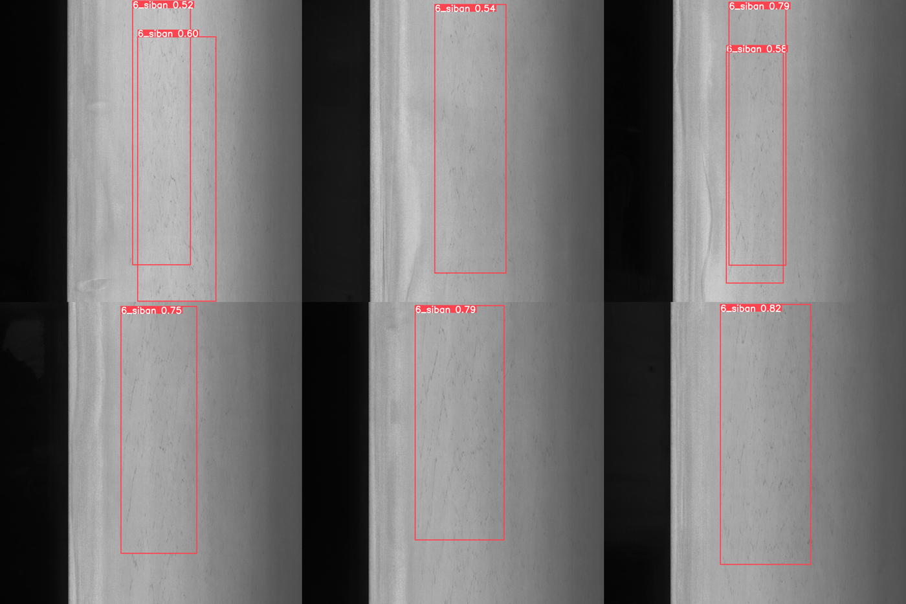
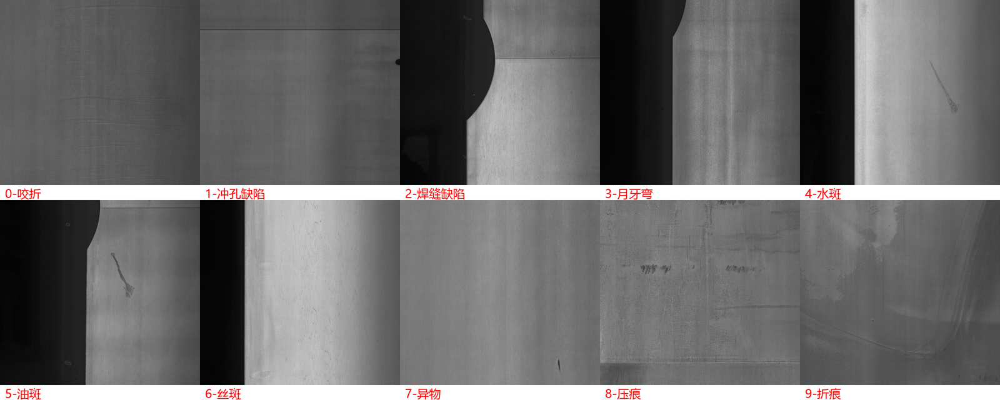
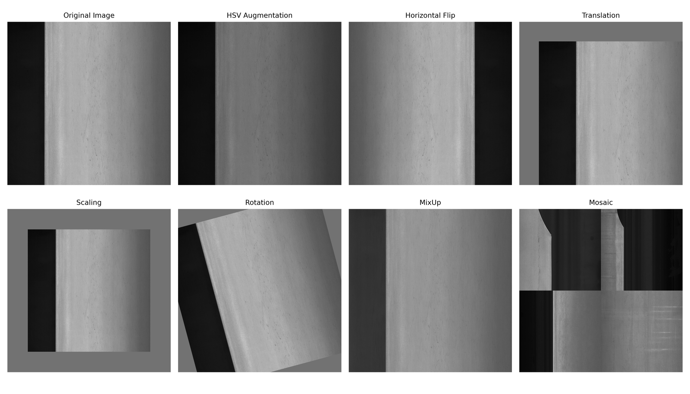
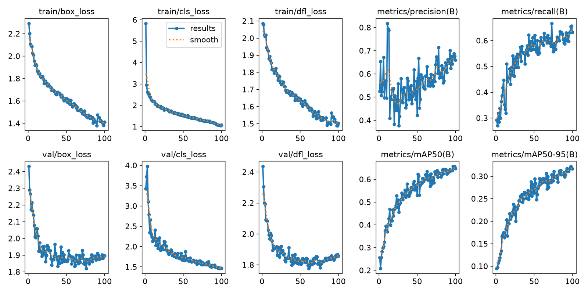
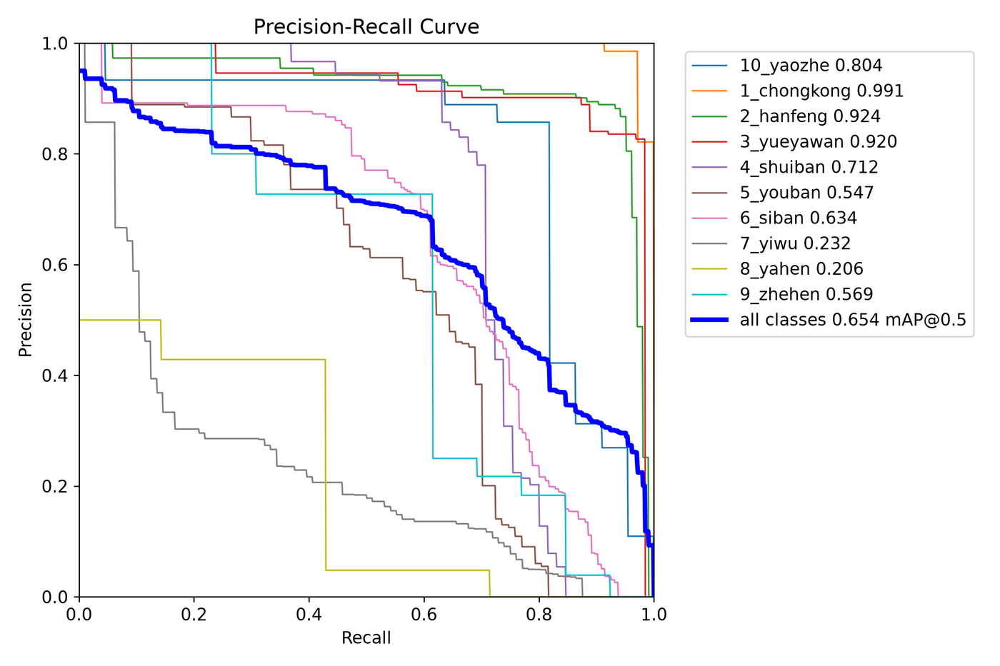
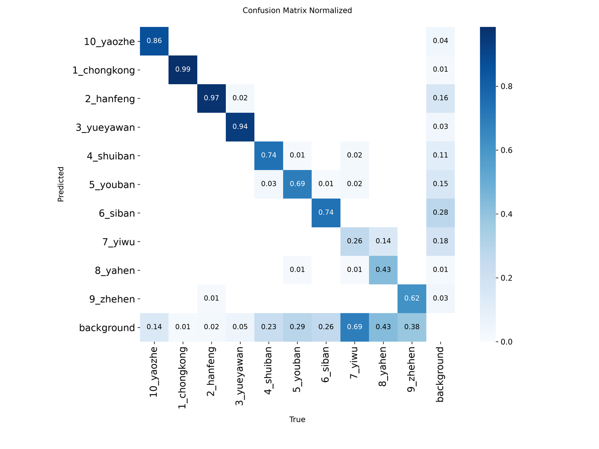
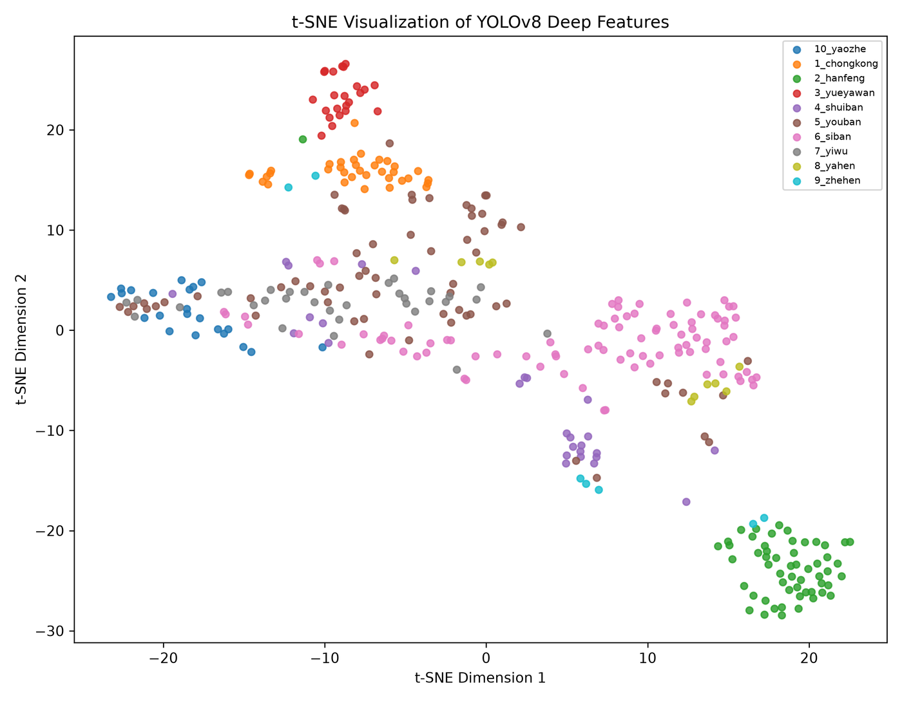

# 基于 YOLOv8 的金属零部件表面缺陷检测

在公开数据集 GC10-DET 上训练 YOLOv8s，检测冷轧钢板表面的 10 类缺陷。测试集 mAP@0.5 为 0.656，其中冲孔、月牙弯、焊缝三类 AP 均超过 0.94。除了常规的检测指标，还用 t-SNE 把检测头前一层的特征降到二维，直接看模型把哪几类混在了一起。



## 结论先说

| 指标 | 测试集 (230 张) |
| :--- | :--- |
| Precision | 0.745 |
| Recall | 0.604 |
| mAP@0.5 | 0.656 |
| mAP@0.5:0.95 | 0.331 |

Precision 明显高于 Recall，说明模型报出来的框基本靠得住，问题在于漏检。漏检集中在压痕、折痕、异物这三类，原因下面第 4 节展开。

## 数据集

GC10-DET，公开的冷轧钢板表面缺陷数据集，不是自采数据。原图约 2048×2048，标注为 YOLO 格式（类别编号 + 归一化的中心坐标与宽高）。

| 划分 | 图片数 | 占比 |
| :--- | ---: | ---: |
| train | 1603 | 69.9% |
| valid | 461 | 20.1% |
| test | 230 | 10.0% |
| 合计 | 2294 | 100% |

10 个类别：

| 编号 | 英文名 | 中文名 | 编号 | 英文名 | 中文名 |
| ---: | :--- | :--- | ---: | :--- | :--- |
| 0 | punching_hole | 冲孔缺陷 | 5 | silk_spot | 丝斑 |
| 1 | welding_line | 焊缝缺陷 | 6 | inclusion | 异物 |
| 2 | crescent_gap | 月牙弯 | 7 | rolled_pit | 压痕 |
| 3 | water_spot | 水斑 | 8 | crease | 折痕 |
| 4 | oil_spot | 油斑 | 9 | waist_folding | 咬折 |



类别之间的实例数很不均衡：丝斑 89 个、油斑 67 个，而折痕只有 7 个、压痕 11 个。这个长尾分布是后面几类指标上不去的直接原因。

## 训练

### 环境

RTX 4060 Laptop 8GB + 16GB DDR5，Windows 11。Python 3.12、CUDA 12.1、PyTorch 2.5.1+cu121、Ultralytics 8.4.48（源码安装）。

### 超参数

| 项 | 值 | 为什么这么选 |
| :--- | :--- | :--- |
| 预训练权重 | yolov8s.pt | 约 11M 参数。m/l 版在 2300 张图上容易过拟合，s 版也更容易塞进 8GB 显存 |
| epochs | 100 | 约 60 轮后曲线已经走平 |
| imgsz | 1024 | 原图 2048，缺陷本身偏小，缩得再狠细节就没了 |
| batch | 4 | 1024 输入下 8GB 显存的上限 |
| workers | 4 | |
| amp | False | 关掉混合精度换稳定性 |
| optimizer | auto | 实际解析为 SGD + momentum |
| lr0 | 0.01 | |
| close_mosaic | 10 | 最后 10 轮关掉 Mosaic，让模型收敛到真实分布 |

### 数据增强

用的是 Ultralytics 默认那一套：HSV 抖动（色调 ×0.9~1.1，饱和度和明度 ×0.6~1.4）、水平翻转 p=0.5、随机平移 10%、随机缩放 0.5~1.5、随机旋转、MixUp（0.65:0.35）、Mosaic 四图拼接、Copy-Paste。



### 训练过程

100 轮约 3.5 小时。前 10 轮各项 loss 快速下降，约第 60 轮进入平台期。best.pt 按验证集 mAP 最高那一轮保存。



三条 loss（CIoU 定位、分类交叉熵、DFL）在训练集和验证集上同步下降，没有出现验证 loss 回升，说明这个规模下 yolov8s 没有过拟合。验证集收敛到 Recall 0.655、mAP@0.5 0.654、mAP@0.5:0.95 0.321，和测试集结果基本一致，划分是干净的。

## 结果分析

### PR 曲线



### 逐类别指标

| 类别 | 中文 | Precision | Recall | mAP@0.5 | 测试集实例数 |
| :--- | :--- | ---: | ---: | ---: | ---: |
| punching_hole | 冲孔缺陷 | 0.967 | 1.000 | 0.978 | 35 |
| welding_line | 焊缝缺陷 | 0.773 | 0.946 | 0.940 | 56 |
| crescent_gap | 月牙弯 | 0.841 | 0.913 | 0.942 | 23 |
| water_spot | 水斑 | 0.674 | 0.778 | 0.735 | 27 |
| oil_spot | 油斑 | 0.696 | 0.376 | 0.524 | 67 |
| silk_spot | 丝斑 | 0.701 | 0.500 | 0.616 | 89 |
| inclusion | 异物 | 0.760 | 0.193 | 0.376 | 33 |
| rolled_pit | 压痕 | 0.715 | 0.364 | 0.409 | 11 |
| crease | 折痕 | 0.546 | 0.429 | 0.355 | 7 |
| waist_folding | 咬折 | 0.781 | 0.545 | 0.685 | 22 |
| **平均** | | **0.745** | **0.604** | **0.656** | **370** |

分成三档看：

几何特征明确的三类（冲孔、焊缝、月牙弯）AP 都在 0.94 以上。冲孔是规则圆孔、焊缝是长直线、月牙弯是固定弧形，边界清楚，模型学得毫不费力。

面状污渍类（水斑、油斑、丝斑）在 0.52~0.74。这几类没有固定形状，边界是渐变的，标注本身就带主观性，Recall 掉到 0.376~0.500。

小目标与稀有类（异物、压痕、折痕）在 0.36~0.41 垫底。异物 Recall 只有 0.193，压痕和折痕在测试集里分别只有 11 和 7 个实例，指标本身的置信区间就很宽。

### 混淆矩阵



对角线之外最亮的是油斑和水斑互相错判，两者都是表面液体残留形成的浅色斑块，纹理高度相似。另一处是大量真实缺陷被判为背景，对应上面的漏检。

### 检测结果的三类难点

翻看推理结果，问题稳定地落在三处：

1. 小尺寸的压痕和折痕直接漏掉，缺陷像素太少且与背景对比度低
2. 油斑和水斑混淆，框的位置是对的，类别标错
3. 异物严重漏检，Recall 0.193 意味着五个里只能找到一个

冲孔的置信度普遍在 0.9 以上且框贴得很紧，月牙弯和焊缝在 0.7~0.95。

### t-SNE 特征可视化

指标只说明准不准，看不出模型内部把哪几类当成了一类。所以在 `model.model[-2]`（检测头前一层）挂 forward hook，按标签把每个缺陷区域裁出来逐个前向，收集特征后标准化、PCA 降到 50 维去噪，再用 t-SNE 降到 2 维。



看到的和指标完全对得上：

- 冲孔、月牙弯、焊缝各自聚成紧凑且彼此分离的团，其中冲孔最紧密，和它 0.978 的 AP 一致
- 油斑与丝斑的点大面积交叠，这是它们 Recall 只有 0.376 和 0.500 的特征层面证据
- 异物最松散，还和背景样本交错在一起，解释了 0.193 的 Recall
- 折痕和压痕点太少（7 个和 11 个），分布看不出结论

一句话：这个模型的瓶颈不在检测框回归，而在特征层面就没把纹理相似的几类区分开。想提升就得从特征判别性入手，比如引入注意力模块，或者针对长尾类别做重采样和针对性增强。

## 目录结构

```
yolov8-metal-defect-detection/
├── data/
│   └── gc10det.yaml          # 数据集配置，10 类，用前改 path
├── src/
│   ├── check_dataset.py      # 训练前自检：图标是否成对、坐标是否归一化
│   ├── train.py              # 训练，默认超参数即上表
│   ├── val.py                # 评估，打印整体与逐类别指标
│   ├── predict.py            # 推理并保存带框结果
│   └── tsne_features.py      # 特征提取 + PCA + t-SNE 可视化
├── docs/figures/             # 上面这些图
└── requirements.txt
```

## 复现步骤

```bash
# 1. 装环境。PyTorch 必须走 CUDA 源，否则拿到 CPU 版
pip install torch==2.5.1 torchvision==0.20.1 --index-url https://download.pytorch.org/whl/cu121
pip install -r requirements.txt

# 2. 自行下载 GC10-DET，按 data/gc10det.yaml 顶部注释摆好目录，改掉 path

# 3. 先自检，别急着训
python src/check_dataset.py

# 4. 训练，8GB 显存约 3.5 小时
python src/train.py

# 5. 在测试集上评估
python src/val.py --weights runs/detect/train/weights/best.pt

# 6. 单图推理
python src/predict.py --weights runs/detect/train/weights/best.pt --source your_image.jpg

# 7. t-SNE 特征可视化
python src/tsne_features.py --weights runs/detect/train/weights/best.pt --split test
```

## 关于这个仓库

几点需要讲清楚：

- **数据集是公开的 GC10-DET，不是自采自标**。2294 张图全部来自该数据集。
- **数据集和权重都不在仓库里**。数据集请自行下载，`yolov8s.pt` 会在首次训练时自动拉取，训练产出的 `best.pt` 体积太大没有入库。
- **README 里所有指标都出自 2026 年 6 月的课程设计报告**，是当时那一次真实训练的结果，没有重新跑过，也没有一个数是估的。
- **`docs/figures/` 下的 7 张图是那次训练的实际产物**，包括 Ultralytics 自动生成的训练曲线、PR 曲线、混淆矩阵，以及自己写脚本画的 t-SNE 图。报告里引自他人论文的插图没有收录。
- **`src/` 下的代码是按报告记录的方法重写的**。原始工程文件已丢失，这些脚本严格照着报告第 3、4 章描述的流程和超参数复现，接口和默认值与当时一致，但不是原始文件本身。

## 参考

- Jocher G, et al. Ultralytics YOLOv8. https://github.com/ultralytics/ultralytics
- Van der Maaten L, Hinton G. Visualizing Data using t-SNE. Journal of Machine Learning Research, 2008.
- GC10-DET: Lv X, et al. Deep Metallic Surface Defect Detection: The New Benchmark and Detection Network. Sensors, 2020.

## License

MIT，见 [LICENSE](LICENSE)。数据集版权归原作者所有，本仓库不包含任何数据集文件。
